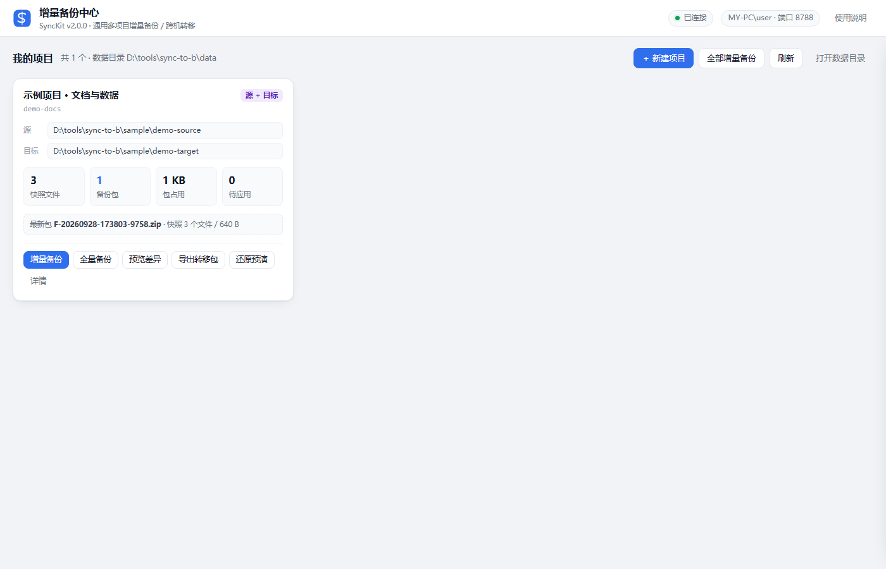
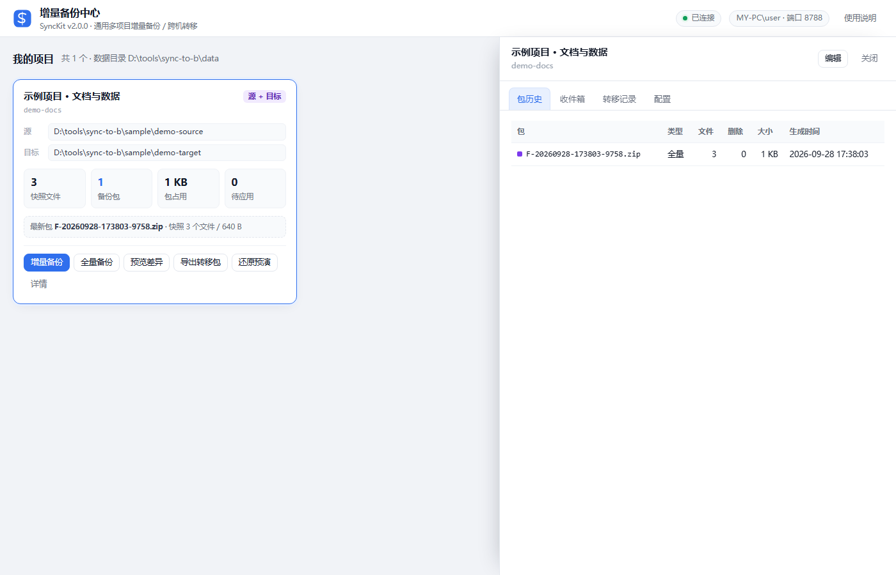
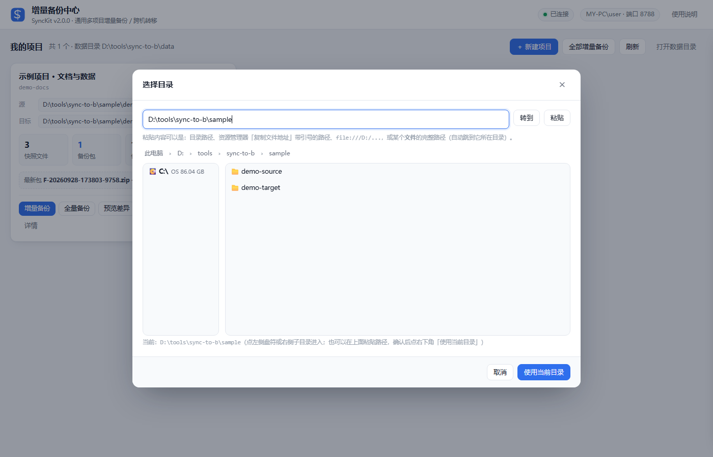

# SyncKit · 通用增量备份与跨机转移工具

把一个目录登记成「项目」，日常只打包变化的文件（增量），把包塞进一个**自包含的转移包**带到另一台机器，双击一次就还原。

- **通用**：不再绑定 Verdaccio，任何目录都能作为项目；一台机器可以同时管理很多个项目。
- **可视化**：浏览器里的本地界面（`start-gui.bat`），点点鼠标完成备份 / 还原 / 导出 / 导入。
- **好转移**：转移包是一个 zip，里面自带还原脚本、说明和 SHA256 校验清单 —— 目标机不需要预装本工具。
- **可控**：链式校验 + 逐文件 SHA256 + 先校验后落地，缺包 / 乱序 / 拷贝损坏都会明确报出来，不会把一个坏状态写进去。

---

## 目录

- [一分钟上手](#一分钟上手)
- [三个核心概念](#三个核心概念)
- [图形界面](#图形界面)
- [流程 A：用界面（备份端 → 还原端）](#流程-a用界面备份端--还原端)
- [流程 B：只用命令行](#流程-b只用命令行)
- [转移包的细节](#转移包的细节)
- [可靠性机制](#可靠性机制)
- [项目配置 projects.json](#项目配置-projectsjson)
- [目录结构](#目录结构)
- [定时自动备份](#定时自动备份)
- [常见问题](#常见问题)
- [命令行速查](#命令行速查)

---

## 一分钟上手

工具根目录就是本目录（`sync-to-b`）。整个目录可以直接拷到任意位置使用，不写注册表、不改系统。

**首次使用先准备配置**：把示例配置复制成实际配置（仓库里不带 `projects.json`，它是本机专属文件）：

```powershell
copy projects.example.json projects.json
```

不复制也能用 —— 界面会是空的，直接点「新建项目」自己填一样的。

**双击 `start-gui.bat`** → 浏览器自动打开本地界面 → 会看到配置里的示例项目：

| 项目 | 说明 |
|---|---|
| `demo-docs` | 示例项目（源 `sample\demo-source`，目标 `sample\demo-target`），可以直接点「全量备份」体验完整流程；不需要了在界面上删掉这项即可 |

要备份自己的目录，点右上角「新建项目」，源目录填哪个都行 —— 工具本身与具体业务无关。

> 需要 PowerShell 5.1（Windows 10/11 自带）和 .NET 自带的压缩库，**不需要联网、不需要管理员权限、不需要装任何软件**。

---

## 三个核心概念

### 1）项目（Project）

一个项目 = 一对目录 + 一些规则，写在 `projects.json` 里：

- **源目录**：要备份的目录（在备份端填）。
- **目标目录**：还原到哪（在还原端填）。
- **排除规则**：哪些文件/目录不参与备份。
- **保留包数**、**打包前后要执行的命令**（例如 `docker pause`）。

同一台机器可以既是备份端又是还原端，两个目录都填即可。

### 2）包（Package）

每次备份产出一个 zip 包，两种类型，连成一条链：

```
F-20260928-103000-a1b2.zip ── I-20260928-160000-c3d4.zip ── I-20260929-090000-e5f6.zip ── …
        （全量包，链头）              （增量包）                  （增量包）
```

- `F-` 全量包：包含全部文件，是新链条的起点。
- `I-` 增量包：只包含相对上次快照**新增/修改**的文件，外加一份**删除清单**。
- 每个包内都记录了上一包的 ID（`base`），还原端沿这条链依次应用，缺一环就会明确报错。

包内结构：

```
files\<相对路径>   本包包含的文件（保留原修改时间）
inc.meta           id / base / type / project / 每个文件的 SHA256 / 删除清单
```

### 3）转移包（Transfer Bundle）

把「要带走的包」+「还原工具」+「说明」+「校验清单」打成一个 zip：

```
sync-demo-docs-20260928-170423.zip
├── 说明.txt              步骤说明 + 每个包的 SHA256
├── bundle.json           包清单与来源信息
├── sha256.txt            转移包内全部文件的 SHA256
├── restore.bat           ← 目标机双击这个
├── packages\             备份包本体（F-*.zip / I-*.zip）
└── sync-tool\            精简版还原工具 + 预填好的 projects.json
```

**默认只装「还没导出过的新包」**，所以日常每次转移都很小；要整体搬家时选「导出全部现存包」。

---

## 图形界面





顶栏：连接状态、机器名、端口、使用说明。

工具条：`＋ 新建项目`、`全部增量备份`、`刷新`、`打开数据目录`。

每个项目一张卡片：

- 顶部标签：`备份端` / `还原端` / `源 + 目标`
- 源 / 目标路径（点一下即复制；源目录不存在会标红）
- 四个数字：快照文件数、备份包数、包占用空间、待应用包数
- 最新包的链条信息
- 按钮：**增量备份 / 全量备份 / 预览差异 / 导出转移包 / 还原预演 / 详情**

点卡片打开右侧详情抽屉，四个页签：

| 页签 | 内容 |
|---|---|
| 包历史 | 每个包的 ID、类型、文件数、删除数、大小、生成时间 |
| 收件箱 | 当前已应用到哪个包、可应用链、包能否应用，以及「应用 / 预演 / 导入 / 打开收件箱」 |
| 转移记录 | 每次导出/导入的时间、去向、形式、包数 |
| 配置 | 项目的全部配置项，可编辑、删除、打开数据目录 |

底部是**实时日志面板**：任务运行时逐行带色输出，可取消、可收起。

### 选目录（目录选择器）

新建/编辑项目时点「源目录」或「目标目录」右侧的「选择」按钮，会打开目录选择器：



- **地址栏可以直接粘贴路径**：在输入框里 `Ctrl+V` 后回车，或者点右侧的**「粘贴」**按钮（自动从剪贴板取）。
- 粘贴内容会自动清洗，下面这些写法都能识别：
  - 普通路径：`D:\备份\某目录`
  - 资源管理器「复制文件地址」的**带引号**结果：`"D:\备份\某目录"`
  - 浏览器地址栏的 `file:///D:/备份/某目录`
  - 正斜杠写法 `D:/备份/某目录`、尾部多余反斜杠
  - **某个文件的完整路径** —— 会自动跳到它所在的目录
- 路径不存在时会在上方明确提示「找不到这个路径：…」，不会再默默跳到别的地方。
- 左边是盘符列表（带卷标和剩余空间），右边是当前目录的子目录，上方是面包屑，都可以点。
- 中文、空格、`+` 等特殊字符的目录名都正常。
- 确认好之后点右下角「使用当前目录」。

界面只监听本机 `http://localhost:8787`（端口被占用会自动顺延），并带随机令牌校验；**关掉那个命令行窗口服务就停了**（任务运行中请不要关）。

---

## 流程 A：用界面（备份端 → 还原端）

### 一次性：备份端（电脑 A）

1. 把工具目录拷到电脑 A 上任意位置，双击 `start-gui.bat`。
2. `＋ 新建项目` → 填**项目 ID**（字母数字，例如 `drive-backup`）、**源目录**（要备份的目录）、按需填排除规则与保留包数 → 保存。
3. 点卡片上的「**全量备份**」（首次必须做一次，作为链条起点）。

### 一次性：还原端（电脑 B）

1. 在电脑 A 上点「**导出转移包**」→ 选 U 盘或目录 → 得到一个 `sync-<项目>-<时间>.zip`。
2. 把这个 zip 拷到电脑 B 的固定目录（例如 `D:\备份同步\`）并解压。
3. 打开解压出来的 `sync-tool\projects.json`，把 `target` 改成电脑 B 上要还原到的目录。
4. 双击 `restore.bat`，等它跑完。

> 想先看看会做什么而不实际写入：`restore.bat -Plan`。

### 之后每次

- 电脑 A：界面里点「**增量备份**」→ 点「**导出转移包**」（默认只装新包，几秒完成）。
- 电脑 B：把新的 zip 解压到**同一个目录**（同名文件覆盖）→ 再双击一次 `restore.bat`。

进度记在转移包目录的 `data\` 里，会累积，不会重复应用。

### 如果电脑 B 上也装了本工具

就不用转移包了：直接把包拷进 `data\projects\<项目ID>\inbox\`，或者在界面里点「导入转移包」（会自动校验 SHA256 再放进收件箱），然后点「应用收件箱中的包」。

---

## 流程 B：只用命令行

```powershell
# —— 备份端 ——
.\bin\backup.ps1 -Project demo-docs -Full      # 首次：全量包
.\bin\backup.ps1 -Project demo-docs            # 日常：增量包
.\bin\backup.ps1 -DryRun                       # 预览全部项目的变化，不生成包
.\bin\backup.ps1 -Target E:\                   # 生成后顺带拷到 U 盘

# —— 转移 ——
.\bin\transfer.ps1 -Action export -Project demo-docs -Dest E:\
.\bin\transfer.ps1 -Action export -Project demo-docs -Dest D:\搬家 -Include all -SplitMB 3500
.\bin\transfer.ps1 -Action import -Bundle E:\sync-demo-docs-20260928-170423.zip -Apply
.\bin\transfer.ps1 -Action list

# —— 还原端 ——
.\bin\restore.ps1 -Project demo-docs -Plan     # 预演
.\bin\restore.ps1 -Project demo-docs           # 应用
.\bin\restore.ps1 -Bundle "D:\备份同步\sync-demo-docs-20260928-170423" -Plan   # 转移包模式
```

所有脚本都支持 `-LogFile <路径>` 把日志同时写进文件（界面就是靠它显示实时日志的）。

---

## 转移包的细节

- **单文件 zip** 或**目录**两种形式（`-Format zip|folder`）。目录形式可以直接在里面双击 `restore.bat`，适合网络共享。
- **默认只带新包**（`-Include new`，记在项目的 `state\exports.json` 里）；`-Include all` 才带全部现存包。
  - 如果本批只含增量包，导出时会**自动补上最近的全量包**作为链头，保证目标机解得开链。
- **分卷**：`-SplitMB 3500` 会把 zip 切成 `xxx.zip.part001`、`.part002`…… 并生成 `join-parts.bat`，目标机先运行它合并回完整 zip 再解压（应对 FAT32 单文件 4GB 限制）。
- **校验**：转移包里有 `sha256.txt`（包内每个文件的哈希）和 `bundle.json`（每个备份包的 SHA256）。导入时会逐个核对，不一致会明确报出并拒绝落地；命令行也可用 `certutil -hashfile <文件> SHA256` 手工核对。

---

## 可靠性机制

| 机制 | 说明 |
|---|---|
| **链校验** | 增量包记录 `base`（上一包 ID）。还原端只应用能接上当前状态的包，缺中间包 / 乱序 / 缺全量包都会明确报出，**不会应用错**。 |
| **重新对齐** | 现链接不上时，可以用**更新的全量包**直接对齐：全量包自包含全部文件，且应用时会做镜像清理，落在任何旧状态上都安全。 |
| **先校验后落地** | 应用前先把整包解压到临时目录、逐文件核对 SHA256，全部通过才开始写入，避免“半新半旧”。 |
| **删除同步** | 源端删掉的文件记录在包的 `[deleted]` 清单里，还原端一并删除，并清理变空的目录。 |
| **镜像清理** | 应用全量包时，目标目录中不在该包清单里的文件会被删除 —— 所以无论目标目录之前是什么状态，应用完都与全量包完全一致。 |
| **失败可重入** | 打包时被占用、读失败的文件**不计入清单**，下次运行自动重试；应用操作可以安全重复执行（包按需移入 `applied\`，进度落盘）。 |
| **精确比对** | 增量比对用「文件大小 + 精确 UTC 修改时间」，不用哈希全文，几十万文件也是秒级。 |
| **不删业务文件的清理** | 临时目录清理失败只记一条告警，绝不会因为“临时文件删不掉”而让整个备份/还原失败。 |

---

## 项目配置 projects.json

```jsonc
{
  "version": 2,
  "dataRoot": "data",        // 运行数据目录，可写绝对路径（例如 D:\SyncKitData）
  "defaultKeep": 20,         // 默认保留最近多少个包
  "projects": [
    {
      "id": "demo-docs",                     // 唯一标识，只用字母数字 . _ -，会作为目录名
      "name": "示例项目 · 文档与数据",         // 界面显示名
      "source": "sample\\demo-source",        // 相对工具根目录或绝对路径；留空表示本机不参与备份
      "target": "sample\\demo-target",        // 还原目标；留空表示本机不参与还原
      "exclude": [                           // 排除规则，见下
        "*.tmp",
        "cache"
      ],
      "keep": 10,                            // 该项目保留最近多少个包，0 = 不清理
      "preCommand": "",                      // 打包前执行；失败则中止本次打包（例：net stop MyService）
      "postCommand": "",                     // 打包后执行；失败只告警（例：net start MyService）
      "note": "备注"
    }
  ]
}
```

**排除规则写法**（对相对路径匹配，不区分大小写）：

| 写法 | 含义 |
|---|---|
| `*.log` | 任意层级下、名字匹配 `*.log` 的文件/目录 |
| `node_modules` | 任意一层目录名等于它，就整棵排除 |
| `docs/tmp` | 指定路径前缀（`docs/tmp/...` 全部排除） |
| `**/cache/**` | 任意层级的 `cache` 目录 |

> 注意：JSON 里反斜杠要写成 `\\`。界面上直接填「每行一条」，不用管转义。

---

## 目录结构

```
sync-to-b\
├── start-gui.bat              双击启动本地界面
├── projects.example.json      配置模板（复制为 projects.json 使用）
├── projects.json              多项目配置（本机专属文件，不进仓库）
├── README.md                  本文档
├── bin\
│   ├── backup.ps1             备份（生成全量/增量包）
│   ├── restore.ps1            还原（应用包）
│   ├── transfer.ps1           导出/导入转移包
│   └── start-gui.ps1          本地界面服务
├── lib\SyncKit.psm1           通用核心（配置/扫描/打包/应用/转移）
├── web\index.html             界面（单文件，无外部依赖）
├── sample\demo-source\        示例项目的源目录
├── legacy\                    旧的 verdaccio 专用脚本（保留备查/回滚）
└── data\                      运行数据（可整体删除，包会丢但状态会重建）
    ├── projects\<项目ID>\
    │   ├── increments\        本机生成/收到的包（应用到 applied\）
    │   ├── inbox\             ★还原端放包的地方（应用后移入 applied\）
    │   ├── state\             state.txt（打包快照）、applied.json（还原进度）、exports.json（转移记录）
    │   └── logs\              每次运行的日志
    └── runtime\jobs\          界面任务的实时日志
```

**打包端 / 还原端的分工**（同一台机器可以两者都做，互不影响，因为用的是不同文件）：

| 侧 | 用到的目录 | 状态文件 |
|---|---|---|
| 打包端 | `increments\` | `state\state.txt`（记录上次快照的文件清单） |
| 还原端 | `inbox\` | `state\applied.json`（记录已应用到哪个包） |

> 所以**不要把 `data\` 从一台机器拷到另一台机器**；那会带着别人的进度。转移包才是正确的搬运单位。

---

## 定时自动备份

用 Windows 计划任务调用命令行即可（管理员 PowerShell，路径按实际改）：

```powershell
$dir = 'D:\tools\sync-to-b'
$action  = New-ScheduledTaskAction -Execute 'powershell.exe' `
  -Argument ('-NoProfile -ExecutionPolicy Bypass -File "{0}\bin\backup.ps1" -LogFile "{0}\data\auto-backup.log"' -f $dir)
$trigger = New-ScheduledTaskTrigger -Daily -At '02:00'
Register-ScheduledTask -TaskName 'SyncKit 每日增量备份' -Action $action -Trigger $trigger
```

想顺带把包拷到 U 盘：`-Target E:\`（U 盘不在时只告警，不影响备份）。
想更省事地转移，可以再加一条 `transfer.ps1 -Action export -Dest E:\`。

---

## 常见问题

**Q：漏带了一次增量包会怎样？**
还原端链校验会拒绝后面的包并提示缺哪一包，把漏的那包补过来再跑一次即可（之前跑过的不会重复应用）。

**Q：想重新做一次全量、彻底对齐？**
备份端点「全量备份」，还原端应用这个新全量包即可。全量包会做镜像清理，目标目录会和它完全一致，不需要手工清理。

**Q：源目录被程序占用着，打包会失败吗？**
单个文件读失败不会中断整体备份，该文件不计入这次清单，**下次运行会自动重试**。要保证严格一致，可以在项目里配 `preCommand` / `postCommand`（例如暂停写入数据的服务）。

**Q：删除会同步吗？会不会误删目标目录里的其它文件？**
增量包只删除「源端删过、且清单里记着的」文件。目标目录里其它文件只有在**应用全量包**时才会被镜像清理掉。

**Q：还原时提示有文件删不掉？**
通常是被别的程序占用。该包不会标记为已应用，关掉占用程序后**重跑同一命令**即可（操作可安全重复）。

**Q：`data\` 目录能删吗？**
能。删掉后打包端会丢失“上次快照”，需要重新做一次全量备份；还原端会丢失“已应用到哪”，也需要一个全量包重新对齐。**删之前先确认包还在。**

**Q：原来的 `make-increment.ps1` / `apply-increment.ps1` 呢？**
已移到 `legacy\`，内容一字未改，仍然可以按老办法用。新工具是它的通用化版本：老方案里的链校验、SHA256、镜像清理、失败重入等机制全部继承，另外补了多项目、界面、转移包。

**Q：双击 `start-gui.bat` 弹一堆「'xxx' 不是内部或外部命令」？**
那是批处理的行尾或编码被改坏了。Windows 的 cmd.exe 用 **OEM 代码页**（中文系统是 936）解析 `.bat`，而且**靠 CR 来找行边界**：

- **LF 行尾** → cmd 会把多行当成一行，文件内容被切片后当命令执行，于是刷出一串「不是内部或外部命令」（连纯 ASCII 的行也会被吞）；
- **UTF-8 存的批处理 + 936 控制台** → 中文全变乱码；
- 再写一句 `chcp 65001` → 运行中切换代码页会让 cmd 的文件读取位置错位，进一步丢行。

所以本仓库的约定是：**`.bat` 只放 ASCII、只用 CRLF**，中文提示一律交给 `bin\*.ps1` 打印（PS 脚本是 UTF-8 BOM，输出正常）。
`.gitattributes` 已把 `*.bat` / `*.cmd` 锁成 `eol=crlf`，正常 clone 不会踩到；但如果你用记事本「另存为」过、或者从别处拷来一个，就要自己保证是 **ASCII + CRLF**。

**Q：界面起不来，提示「无法启动本地服务」？**
先看报错里的**最后一个错误原因**，它已经会直接告诉你是哪种情况：

- `与计算机上的现有注册冲突` / `另一个程序正在使用此文件` —— 该端口被占用，或**被 Windows 保留给了系统**。Docker Desktop、Hyper-V、WSL 会在开机时批量预留端口段，默认的 8787 有可能正好落进去。查一下保留段：

  ```
  netsh interface ipv4 show excludedportrange protocol=tcp
  ```

- 工具会自动从 8787 往后顺延最多 25 个端口，可用的话控制台会打印实际地址（例如顺延到 `http://localhost:8788/`）。
- 想指定别的：`bin\start-gui.ps1 -Port 9000`。
- 想彻底把 8787 要回来：重启一下 Docker / WSL（或重启系统）让保留段重新分配。

> 提示：`-Verbose` 可以看到**每一个**被跳过的端口及其原因。

**Q：目录名里有中文 / 空格 / `+` 会有问题吗？**
不会。备份清单按 UTF-8 记录文件名，浏览接口也按 UTF-8 解码请求参数，中文、空格、`+`、`&` 之类的字符都能正常处理。粘贴路径时也不用自己去引号或转换斜杠，选择器会自动清洗。

**Q：能不能同时跑多个任务？**
界面上一次只允许一个任务（避免两个备份同时写同一份状态）。要并行就开两个命令行窗口跑不同的项目。

---

## 命令行速查

```
bin\backup.ps1
  -Project <ID>    只处理该项目（省略 = 所有配置了源目录的项目）
  -Full            生成全量包
  -DryRun          只预览差异
  -Target <目录>   生成后额外拷贝一份到 U 盘 / 共享
  -Keep <N>        保留最近 N 个包（-1 = 用项目配置）
  -NoHook          不执行项目的前/后置命令

bin\restore.ps1
  -Project <ID>    要还原的项目
  -Bundle <目录>   转移包模式（使用包内自带的配置与 data）
  -Plan            只预览不写入
  -TargetDir <目录> 临时还原到别处（覆盖项目配置的 target）
  -Force           忽略包内项目与当前项目不一致的提示

bin\transfer.ps1
  -Action export|import|list
  -Project <ID>    export 省略 = 所有有包的项目
  -Dest <位置>     导出位置：E:\ 、\\主机\共享 、任意目录
  -Include new|all 只带新包（默认）/ 带全部现存包
  -Format zip|folder
  -SplitMB <N>     分卷大小（0 = 不分卷）
  -Bundle <路径>   import 时的转移包（zip 或目录）
  -Apply           import 后立刻应用

bin\start-gui.ps1
  -Port <端口>     默认 8787，占用则自动顺延
  -NoBrowser       不自动打开浏览器
```

所有脚本都支持 `-Config <projects.json 路径>` 与 `-LogFile <日志路径>`。
